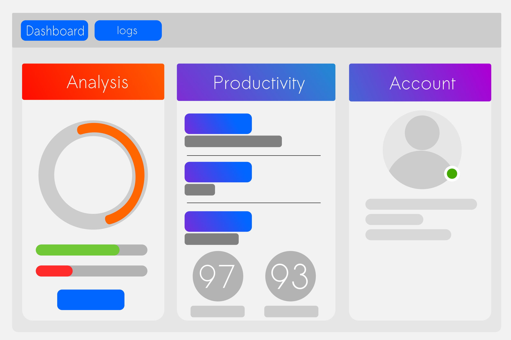

# Client Application

## Introduction
A client application to monitor application usage on a windows system. It relies on web technologies such as javascript, html, css to render the under interface and javascript frameworks such as node.js, jQuery etc in the back ground. It connects to a database which stores the necessary data.

## How to run the application
 `$: npm start`

 
 ## Gallery

